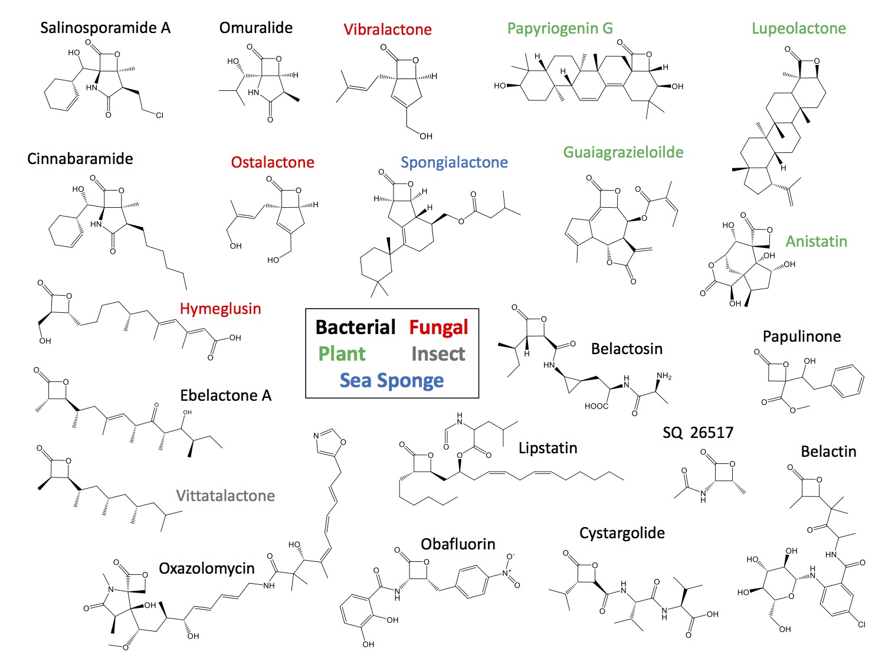

```{r setup, include=FALSE}

packs<-c("flexdashboard","tidyr","kableExtra","genoPlotR","shiny","Biostrings")
lapply(packs,require,character.only=T)

```

Home
=====================================

```{r}

tab<-read.csv("tables/beta_lactone_table.csv",header=T,stringsAsFactors=F)
```


#About {.sidebar}
***
***
**Welcome to the β-Lactone-Tool (βLT)**
<br>
The βLT is a consolidated resource for β-lactone natural products and their biosynthetic gene clusters.  
<br>
This site is curated and maintained by [Dr. Larry Wackett's lab](https://cbs.umn.edu/wackett-lab/home) at the University of Minnesota.  
<br>
The [Wackett](https://cbs.umn.edu/wackett-lab/home) and [Wilmot](https://cbs.umn.edu/contacts/carrie-m-wilmot) labs discovered and characterized the first β-lactone synthetase enzyme ([Christenson *et al.* 2017](http://pubs.acs.org/doi/abs/10.1021/acs.biochem.6b01199)). A major focus in the lab is β-lactone natural product discovery and sharing these findings with the scientific community via the βLT. For more information, see our publications:

*Christenson JK, Richman JE, Jensen MR, Neufeld JY, Wilmot CM, Wackett LP. [**β-Lactone Synthetase Found in the Olefin Biosynthesis Pathway.**](http://pubs.acs.org/doi/abs/10.1021/acs.biochem.6b01199) *Biochemistry.* 2017;56(2):348-51.  [doi:10.1021/acs.biochem.6b01199.](http://pubs.acs.org/doi/abs/10.1021/acs.biochem.6b01199)

*Christenson, JK, Robinson, SL, Engel, TA, Richman, JE, Kim, AN, Wackett, LP. [**β-Lactone decarboxylase: Function, mechanism, and linkage to class III haloalkane dehalogenases.**]  *Biochemistry.* 2017; doi: 10.1021/acs.biochem.7b00667. 


Browse
===================================== 
***
***
```{r}
#selectInput('compound', 'Compounds',unique(tab$Natural_product))
#selectInput('taxonomy', 'Taxonomy',unique(tab$Organism))
```

<style>
.lightgreen table {
  background-color:#eff8e5;
}


</style>

<div class = "lightgreen">
```{r}
#plot(iris$Sepal.Length,iris$Sepal.Width)
#selectInput('taxonomy', 'Taxonomy',unique(tab$Organism))

source("src/gene_plot.r")
r<-gene_plot("data/fasta_prot_bgcs/Cystargolide_renamed.fasta")
tr<-tab[tab$Natural_product=="Cystargolide",]

pr<-tr %>% knitr::kable("html") %>%
  column_spec(1, bold = T, border_right = T) %>%
 kable_styling(bootstrap_options = c("striped", "hover","condensed","responsive"),full_width = F,position="left",font_size=10) #%>%
  #scroll_box(height="1000px", width="2000px")
pr
#r[[1]]
#r[[2]]
```
</div>

Database
===================================== 
***
***


<style>
.lightgreen table {
  background-color:#eff8e5;
}


</style>

<div class = "lightgreen">
```{r}
#tab<-read.csv("tables/beta_lactone_table.csv",header=T)
pl<-tab %>% knitr::kable("html") %>%
  column_spec(1, bold = T, border_right = T) %>%
 kable_styling(bootstrap_options = c("striped", "hover","condensed","responsive"),full_width = F,position="left",font_size=10) #%>%
  #scroll_box(height="1000px", width="2000px")
pl
#add_header_above(pl,c("β-Lactone Natural Products"))
 
```
</div>

